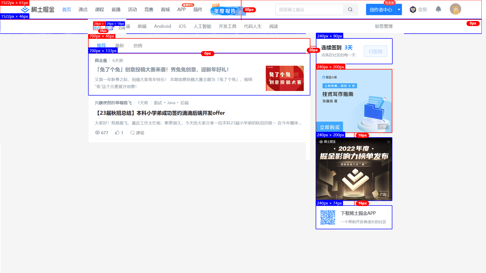
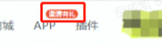

# 第一阶段 - 页面样式

> 1月17日 ~ 1月25日（共8天）
>
> 完成各种仓库、GIT分支、团队账号的初始化
>



```text
// 间距
10px 12px 16px 20px

// 主体宽
700px

// 侧边栏宽
240px
```

## 预期效果

> 现阶段组件内数据全部写死后续统计使用次数后确定数据是从缓存取出还是发送请求获得

### 公共组件

**顶部 tab 栏**



1. 标签可配置，超过数量限制后需要兼容

2. 支持顶部额外标签的配置，颜色内容等不可写死

### 首页

**文章分类 tab 栏**

1. 标签可配置，超过数量限制后需要兼容
2. 选择不同的tab下方文章推荐需要变化

**文章模块**

1. 实现分页效果

**作者榜 / 广告位**

1. 后台动态配置


### 文章详情

**文章内容**

1. 解析`MarkDown`文档的各种标签为样式

2. 添加`H1`标签为锚点链接，点击跳转

3. 为标签添加对应类名等，为后续***自定义主题***做准备

**相关文章**

1. 选出相同标签的前十篇文章，点击查看详情

### 主题化

1. 使用`antd`的动态主题

### 数据来源

2. 现阶段返回写死数据，不做数据库连接

## 任务分配

### 陈昕

1. 首页 作者榜 / 广告位

### 桂礼学

1. 首页文章模块

### 倪成凯

1. 文章内容页`Markdown`样式解析
2. 网站主题切换设计
3. 二次封装 `fetch ` 请求

### 牛铭浩

1. 顶部 tab 栏
2. 文章分类 tab 栏

### 张承桢

1. 文章内容页 相关文章 / 目录

### 郑丹勇

1. 暂无
