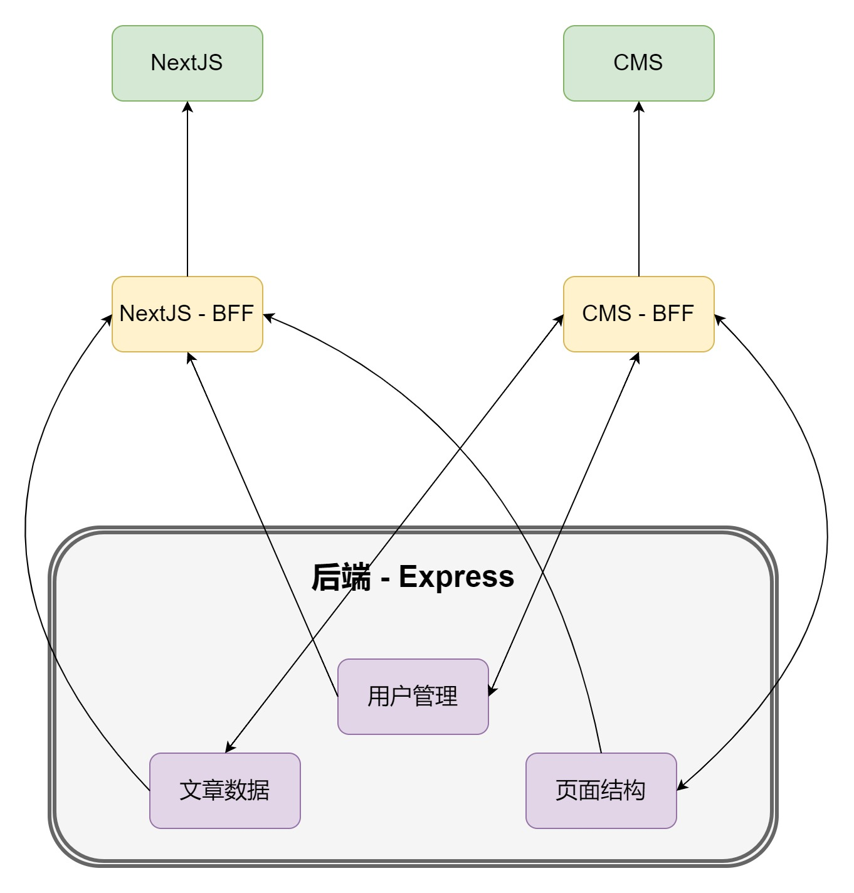
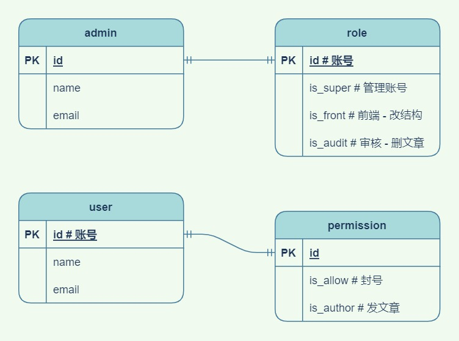
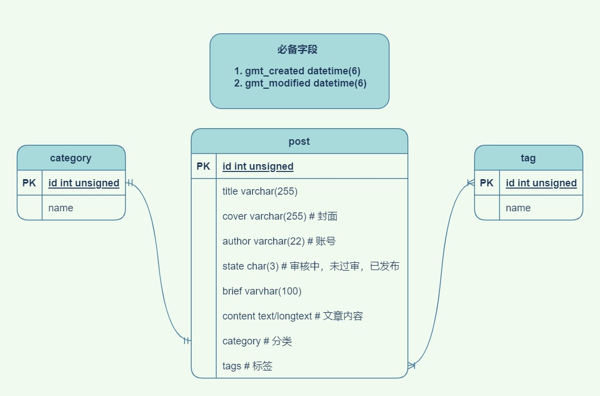

# 第二阶段计划 - 动态数据

> 1月25日 ~ 2月4日（共10天）
>
> 搭建数据库，实现动态的页面数据

## 预期效果

**项目结构**

**数据库**

**数据获取**

1. `NextJs` 发送请求给BFF层，把页面数据变为动态获取的

2. `BFF层` 根据请求头判断设备并根据业务类型（数据 / 页面结构）转发请求给对应的api

3. 现在只实现动态数据，不实现动态结构

## 用户管理服务

1. 管理员登录，免登陆效果
2. 用户管理员权限获取（融合进 `token`）
3. 必要用户数据的CRUD（校验是否有权限）
4. ~~头像上传（图片压缩）~~
5. ~~邮箱验证码登录~~

## 文章管理服务

1. 文章的 `CRUD`
2. 根据文章的各种信息筛选文章
3. 文章封面上传（尺寸格式化）
4. 封面应该压缩为大图和小图

## NextJs BFF层

1. 整理页面必要数据（一个页面只能请求一次）
2. 去除返回的多余字段
3. 根据浏览器信息，请求相应的图片格式
   * WebP（谷歌内核）
   * JPG（IE）

## 任务分配

### 陈昕

1. 用户管理服务编写

### 桂礼学

1. 创建`MySQL`数据库
2. 首页 `BFF` 层编写
3. 实现首页的动态数据

### 倪成凯

1. 创建`MySQL`数据库
2. 文章管理服务编写

### 牛铭浩

1. 首页 `BFF` 层编写
1. 实现首页的动态数据

### 张承桢

1. 实现文章页的动态数据
1. 文章页 `BFF` 层编写

### 郑丹勇

1. 创建 `MySQL`数据库
